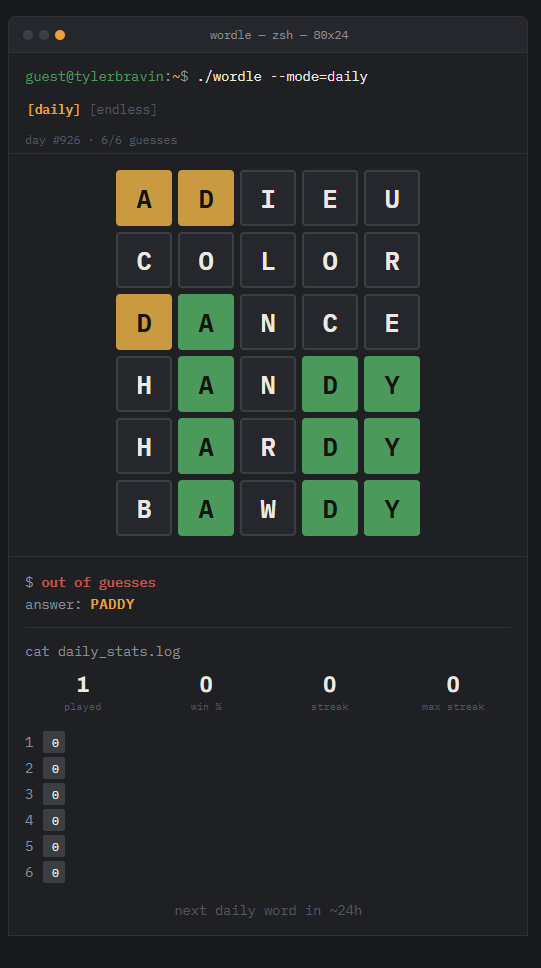
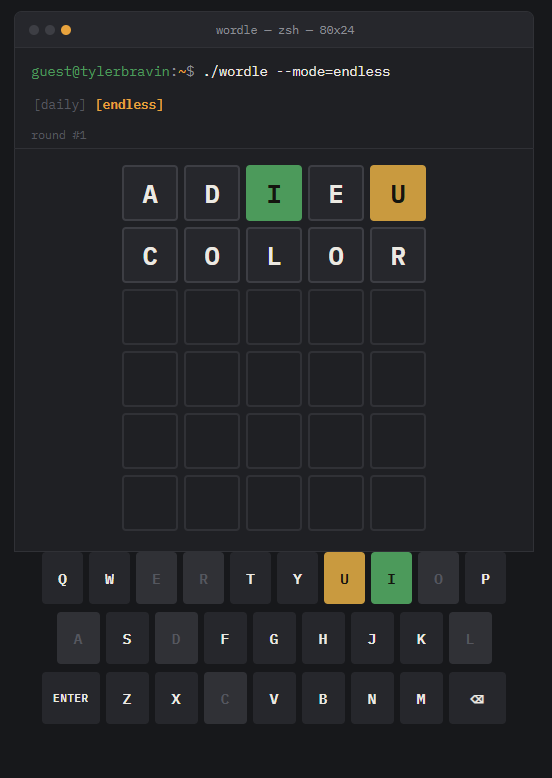

# Wordle Clone


[](https://github.com/tyler-bravin/Wordle-Clone/blob/master/LICENSE)

A Wordle clone with a **Java/Spring Boot** backend and a **React/TypeScript** frontend, self-hosted via **Docker** on Coolify. Built around the same "engineering workstation" aesthetic as the rest of my projects — graphite surfaces, an amber terminal accent, IBM Plex Mono — styled as a fake shell session complete with a blinking prompt and `cat`-style output for stats and word definitions.

> **Disclaimer:** this is an unofficial portfolio/learning project. "Wordle" is a trademark of The New York Times Company. Not affiliated with, endorsed by, or sponsored by the NYT or the creators of Wordle — it recreates the *mechanics* of the game to demonstrate full-stack development, not for public or commercial use. See [`LICENSE`](./LICENSE) for what license terms actually apply (and don't apply) here.

<br>

 

---

### ✨ Key Features
* **Daily Mode**: One shared word per calendar day, the same for every player — derived server-side from a fixed-seed shuffle of the answer list, so it's stable across restarts but not just alphabetical.
* **Endless Mode**: Unlimited rounds via a per-player shuffle bag — every answer word gets dealt exactly once before the bag reshuffles, so nothing repeats until you've genuinely seen the whole pool.
* **Server-Authoritative Guessing**: The answer is never sent to the client until a game ends — every guess is scored on the backend, so it can't be read out of the network tab mid-game.
* **Word Definition Lookup**: Once a game ends, the result panel fetches a definition for the answer from a free external dictionary API, rendered as another terminal-log-style block.
* **Persistent Stats**: Win rate, streak, and guess distribution tracked per mode in `localStorage`, styled as a `cat stats.log` readout.
* **Terminal-Styled UI**: Titlebar, blinking prompt, and `[daily]` / `[endless]` mode tabs — the same shell-session framing device used across my other projects.
* **Fully Fluid Layout**: Tile and key sizing scale continuously with viewport width (`clamp()`), rather than jumping at a single breakpoint, so it holds up from small phones to ultrawide monitors.
* **Dockerized & Coolify-Ready**: Multi-stage Dockerfiles for both services plus a `docker-compose.yml` that doubles as the Coolify deployment target — see the Deployment section below.

---

### 💻 Technologies Used
* **Backend**: Java 21, Spring Boot 3 (Web, Validation, Actuator), Maven
* **Frontend**: React 19, TypeScript, Vite
* **Styling**: Plain CSS with custom properties, `@fontsource` (Archivo + IBM Plex Mono, self-hosted, no external font CDN)
* **Testing**: JUnit 5 + AssertJ (backend), `oxlint` + `tsc` (frontend)
* **Deployment**: Docker (multi-stage builds), nginx (static frontend serving), Coolify + Traefik

---

### 🧠 How It Works

The backend never sends the answer word to the client until a game ends, so it can't be read out of the network tab mid-game — each guess is scored server-side and only per-letter CORRECT/PRESENT/ABSENT feedback comes back.

**Daily mode** derives a deterministic answer from the calendar date: the 2,315-word answer list is shuffled once at startup with a fixed seed, and the day index (days since a fixed epoch) picks a word from that shuffled order.

**Endless mode** uses a per-player shuffle bag: a randomly-ordered queue of every answer word. Each round pops the next word off the queue; once it's empty, a fresh shuffle refills it — guaranteeing the full answer pool gets seen before anything repeats, without ever showing the same order twice.

Both modes share the same guess-scoring logic (`GuessEvaluator`), which handles duplicate letters the way real Wordle does — see `GuessEvaluatorTest` for the specific edge cases.

---

### 🛠️ Installation & Setup

Follow these steps to get a local copy of the project up and running.

1.  **Clone the repository:**
    ```bash
    git clone https://github.com/tyler-bravin/Wordle-Clone.git
    cd Wordle-Clone
    ```

2.  **Run the backend:**
    ```bash
    cd backend
    mvn spring-boot:run
    ```
    Runs on `http://localhost:8080`. Config lives in `src/main/resources/application.yml`.

    > **Note:** `wordle.epoch-date` and `wordle.shuffle-seed` fix the Daily word cycle. Don't change either once real players have started playing Daily puzzles, or the day-to-word mapping will shuffle.

3.  **Run the frontend** (in a second terminal):
    ```bash
    cd frontend
    npm install
    npm run dev
    ```
    Runs on `http://localhost:5173` and talks to the backend via `VITE_API_BASE_URL` (defaults to `http://localhost:8080` in the committed `.env.development` — see `frontend/.env.example` for what other env vars exist).

4.  **Or run both together with Docker:**
    ```bash
    docker compose up --build
    ```
    Frontend on `http://localhost:5173`, backend on `http://localhost:8080`.

5.  **Run the tests:**
    ```bash
    cd backend && mvn test
    cd frontend && npm run build && npm run lint
    ```
    Backend tests cover guess-evaluation edge cases and the Endless shuffle bag's no-repeat guarantee. `tsc -b` type-checks as part of the frontend build; `oxlint` covers linting.

---

### 🚀 Deployment

This assumes a Coolify instance with a domain you control and DNS already pointed at it.

1.  **Create a new resource in Coolify**, type **Docker Compose**, pointed at this repo's root `docker-compose.yml`.
2.  **Assign domains** per service in the Coolify UI — `backend` (e.g. `wordle-api.yourdomain.dev`) and `frontend` (e.g. `wordle.yourdomain.dev`). Coolify provisions Let's Encrypt certs and Traefik routing automatically.
3.  **Set environment variables** on `backend`:
    * `WORDLE_ALLOWED_ORIGINS` = the frontend's final domain — the API rejects browser requests from anywhere else.
4.  **Set the build argument** on `frontend`:
    * `VITE_API_BASE_URL` = the backend's final domain. This is baked into the static bundle at build time, so it must be set *before* deploying, and redeployed if the backend domain ever changes.
5.  **Deploy.** Coolify builds both Dockerfiles and starts the stack.

---

### ⚠️ Known Simplifications

This is a portfolio project, not a production service, so a few corners were cut deliberately:

* **In-memory game state**: Not persisted to a database or Redis — a backend restart loses in-progress games and Endless shuffle bags. Finished-game stats live in the browser's `localStorage` instead, so they survive backend restarts.
* **No accounts**: Endless mode's no-repeat guarantee is scoped to a `playerId` in `localStorage`, not a real user account.
* **Single backend instance**: Sessions live in a `ConcurrentHashMap` on one instance — wouldn't horizontally scale without moving state to something shared like Redis.
* **Third-party dictionary dependency**: The definition lookup depends on a free external API with no SLA. It's deliberately isolated from actual gameplay, so this only affects that one bonus feature — see `DictionaryService`'s Javadoc.

---

### 📜 License
The original code in this repository is licensed under the MIT License — see [`LICENSE`](./LICENSE) for details. That license doesn't extend to the bundled word lists (own MIT licenses from their original sources — see [`backend/src/main/resources/words/README.md`](./backend/src/main/resources/words/README.md)) or to the word "Wordle" itself, which is a trademark of The New York Times Company.
